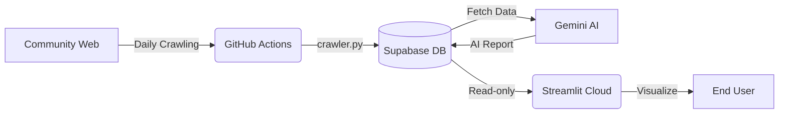

# 📊 Blablalink 인사이트 대시보드 (승리의 여신: 니케)


## 📝 프로젝트 소개
'승리의 여신: 니케' 커뮤니티(블라블라링크)의 실시간 유저 동향, 트렌드, 리스크를 모니터링하고 의사결정권자에게 AI 기반의 전략 리포트를 제공하는 **자동화 인사이트 대시보드**입니다. 

기존 로컬 수집 방식에서 벗어나 **GitHub Actions**와 **Supabase**를 활용한 서버리스(Serverless) 데이터 파이프라인으로 구축되었으며, API 과금을 최소화하기 위해 **AI 배치(Batch) 처리 아키텍처**를 적용했습니다.

---

## 🏗️ 아키텍처 (Data Pipeline)




## 📂 디렉토리 구조

```text

📦 blablalink-dashboard
 ┣ 📂 .github
 ┃ ┗ 📂 workflows
 ┃   ┗ 📜 crawler.yml        # 매일 자정 실행되는 GitHub Actions 스케줄러
 ┣ 📜 app.py                 # Streamlit 대시보드 프론트엔드 코드
 ┣ 📜 crawler.py             # 데이터 수집 및 AI 리포트 생성 백엔드 스크립트
 ┣ 📜 nikke_base.md          # AI 프롬프트 주입용 도메인 백과사전 (RAG 기반)
 ┣ 📜 requirements.txt       # 파이썬 의존성 패키지 목록
 ┗ 📜 README.md              # 프로젝트 문서
```


---


## ⚙️ 설치 및 실행 방법 (로컬 환경)


**1. 저장소 클론 및 패키지 설치**

```bash

git clone [https://github.com/fienn-eda/Blablalink-Dashboard.git](https://github.com/fienn-eda/Blablalink-Dashboard.git)

cd blablalink-dashboard

pip install -r requirements.txt

```


**2. 환경 변수 세팅 (`.env` & `.streamlit/secrets.toml`)**

로컬에서 대시보드를 띄우기 위해서는 `.streamlit/secrets.toml` 파일에 아래 키를 입력해야 합니다.

```toml

SUPABASE_URL = "[https://your-project-url.supabase.co](https://your-project-url.supabase.co)"

SUPABASE_KEY = "your-anon-public-key"

```


**3. 대시보드 실행**

```bash

streamlit run app.py

```


---


## 🔒 보안 및 클라우드 배포 세팅 가이드 (Two-Track 정책)

본 프로젝트는 보안과 자동화를 위해 프론트엔드(대시보드)와 백엔드(크롤러)의 API 권한을 분리하여 운영합니다.


### 1. Database (Supabase) 세팅

* 테이블 목록: `posts`, `comments`, `nikke_arts`, `ai_summaries`

* **보안 (RLS):** 모든 테이블의 RLS(Row Level Security)를 활성화하고, `anon` 역할에게는 **읽기(SELECT) 권한만** 부여합니다.

* **성능 최적화:** 대량 데이터 로딩 방지 및 타임아웃 해결을 위해 복합 인덱스를 적용했습니다.

```sql

CREATE INDEX idx_posts_plate_created ON posts (plate_name, created_at DESC);

```


### 2. Streamlit Community Cloud (프론트엔드)

* 목적: 데이터 읽기 및 시각화

* Secrets 세팅: `SUPABASE_URL`, `SUPABASE_KEY` (**anon public key**)


### 3. GitHub Actions (백엔드 / 크롤러)

* 목적: DB 쓰기/수정 및 AI API 호출

* Secrets 세팅 (`Settings` -> `Secrets and variables` -> `Actions`):

* `SUPABASE_URL`: 프로젝트 URL

* `SUPABASE_KEY`: service_role secret key (RLS를 우회하여 데이터를 적재하기 위함)

* `GEMINI_API_KEY`: Google Gemini API 키 (일일 1회 보고서 생성용)


---

*Created by [Fienn]*


